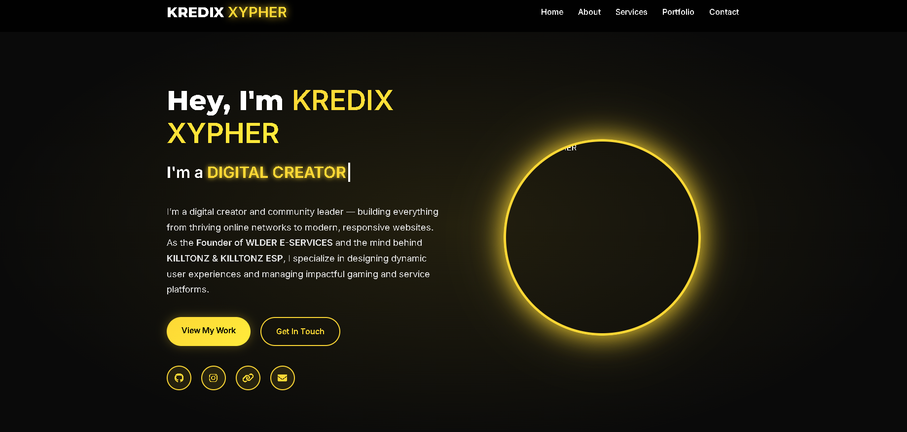

# 🌟 Responsive Portfolio Template



> **Modern • Responsive • Interactive**  
> A professional portfolio template for developers, designers, and digital creators  
> **Made by KREDIX XYPHER**

## ✨ Why This Template?

<div align="center">

| Feature | Benefit |
|---------|---------|
| **Dynamic Animations** | Engage visitors with smooth transitions |
| **Mobile-First Design** | Perfect display on all devices |
| **Dark/Light Mode** | Eye-friendly viewing experience |
| **SEO Optimized** | Better search engine visibility |
| **Fast Loading** | Optimized performance |

</div>

## 🎨 Key Features

- **Typewriter Effect** - Auto-rotating professional titles
- **Scroll Animations** - Powered by AOS.js
- **Customizable Colors** - Easy theme modification
- **Responsive Layout** - Flawless on any screen size
- **Interactive Elements** - Hover effects & micro-interactions
- **Contact Form** - Ready-to-use with FormSubmit

## 🛠️ Tech Stack

| Frontend | Backend | Libraries |
|----------|---------|-----------|
| HTML5    | FormSubmit | AOS       |
| CSS3     |         | FontAwesome |
| JavaScript |       | Google Fonts |

## 🚀 Quick Start

1. Clone repository:
```bash
git clone https://github.com/kredix-xypher/portfolio-template.git
```

2. Customize content in `index.html`

3. Deploy to:
[](https://www.netlify.com/)
[](https://vercel.com/)

## 📌 Customization Guide

1. **Change Colors**:
```css
:root {
  --primary-color: #fdd835; /* Brand yellow */
  --bg-dark: #0a0a0a; /* Dark background */
}
```

2. **Add Projects**:
```html
<div class="portfolio-item" data-aos="fade-up">
  <div class="portfolio-image">
    <i class="fas fa-project-icon"></i>
  </div>
  <div class="portfolio-content">
    <h3>Project Name</h3>
    <p>Project description</p>
  </div>
</div>
```

## ⚠️ License
MIT License - Free for personal and commercial use

---


## 🔥 Key Features

+ Dynamic Typewriter Effect (Auto-rotating titles)
+ Smooth Scroll Animations (AOS powered)
+ Dark/Light Mode Toggle (Easy on eyes)
! Fully Responsive (Mobile-first design)
- No jQuery Dependency (Pure JS/CSS)
